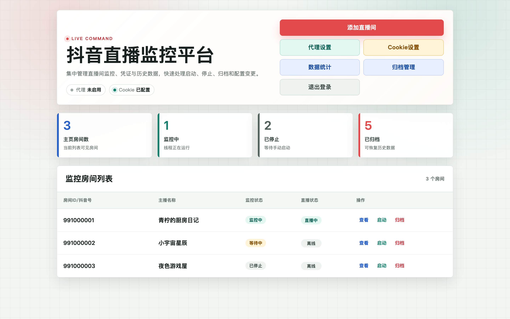
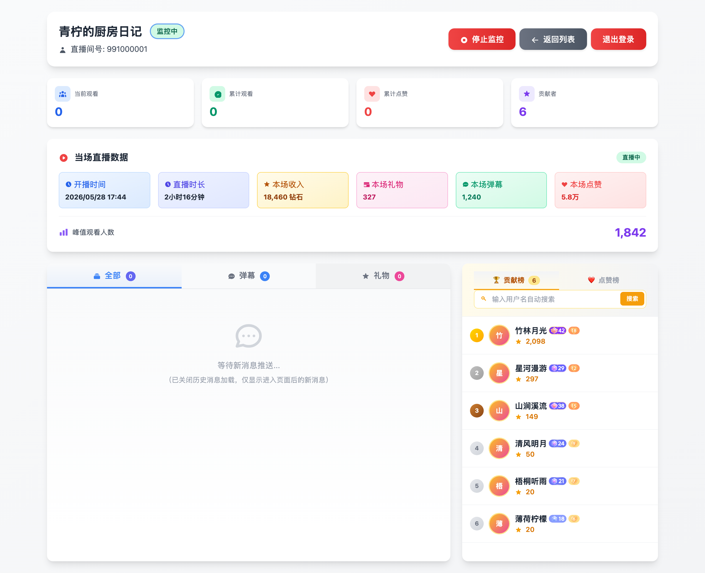
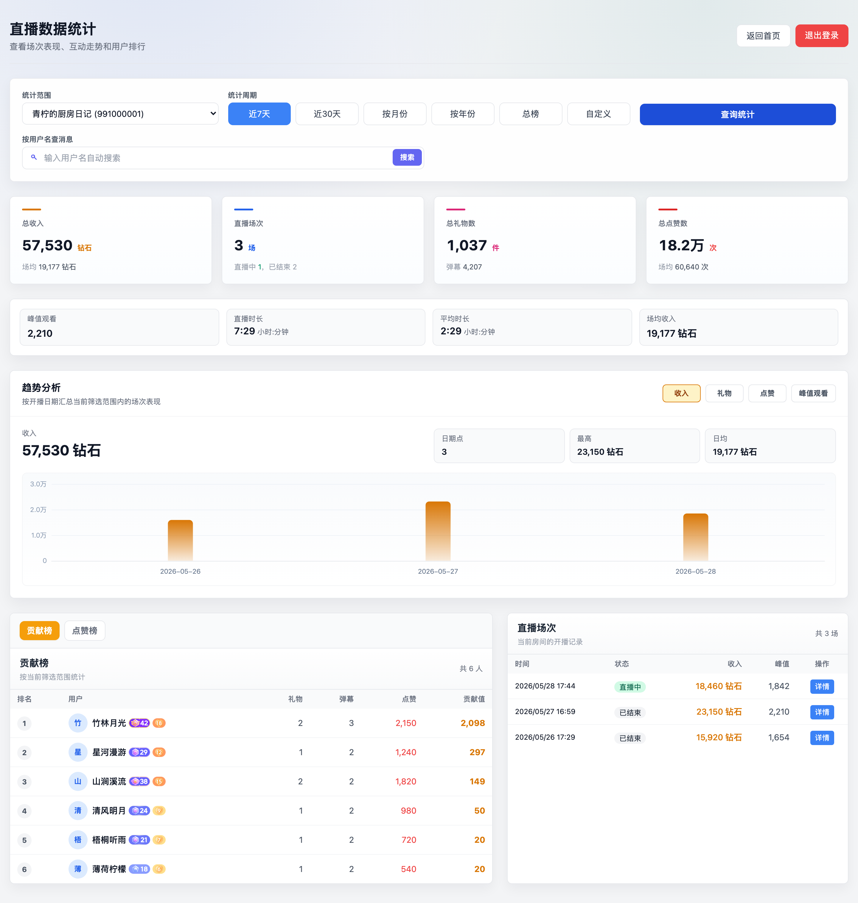
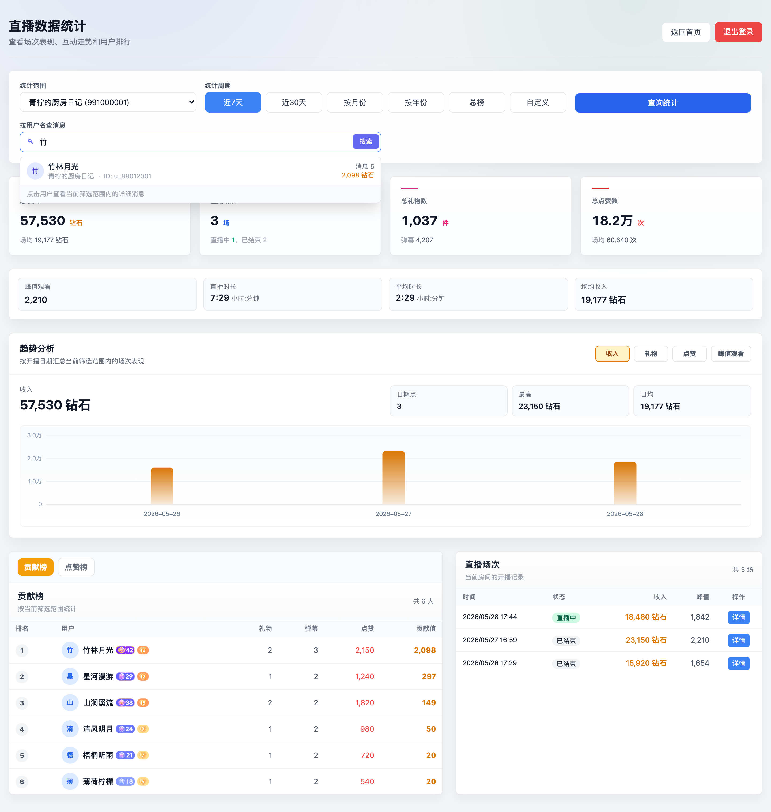
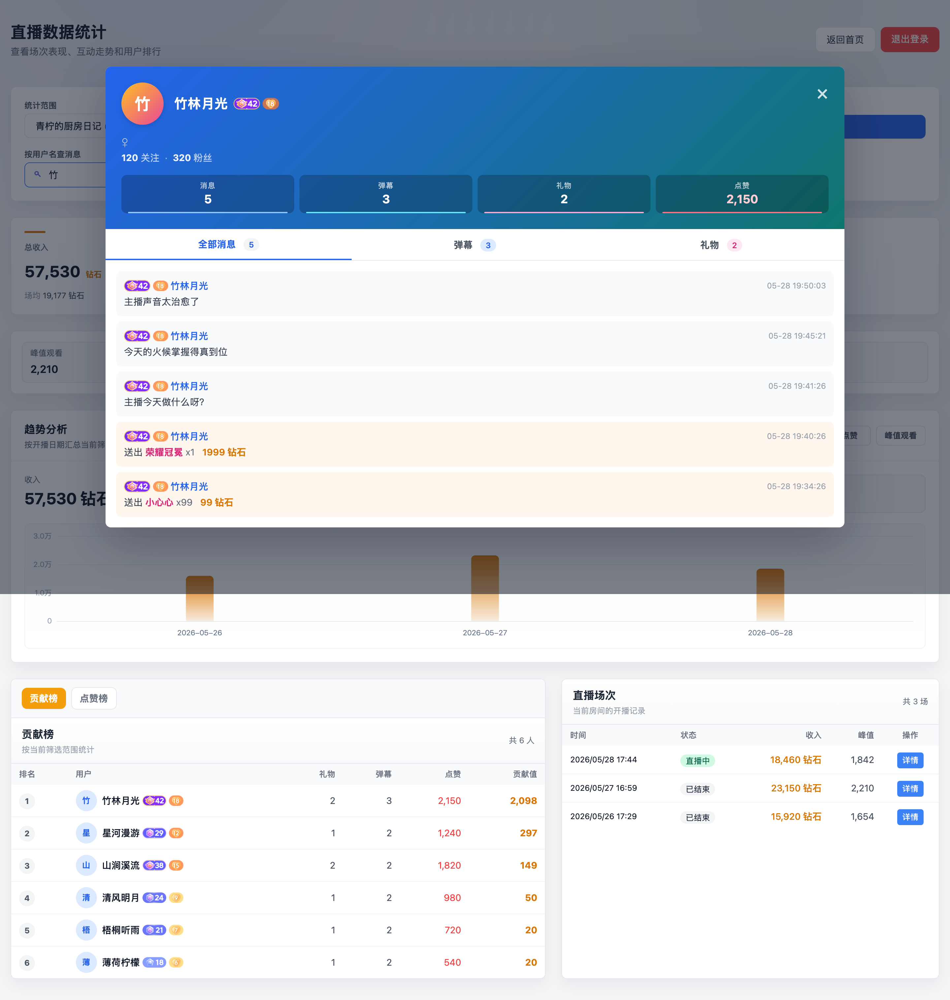

# DouyinLiveHub

抖音直播数据记录站。多直播间持续监控、弹幕/礼物/点赞实时采集、按时段查统计、按用户名查贡献与历史消息。

[](https://www.python.org/downloads/)
[](https://flask.palletsprojects.com/)
[](https://docs.docker.com/compose/)
[](LICENSE)

> 截图均为脱敏 Mock 数据，主播昵称、用户名、礼物记录均为虚构。

---

## 一、功能介绍

### 1. 首页：直播间集中管理



- 添加直播间后自动等待开播、断线后按策略重连、达到上限后回到轮询。
- 顶部 KPI 卡片直观看到「主页房间数 / 监控中 / 已停止 / 已归档」。
- 表格里每行展示监控状态 + 直播状态 + 操作（查看 / 启停 / 归档），支持代理与抖音 Cookie 即时切换。
- 「归档管理」入口指向永久保留数据的房间档案；归档不删数据，只把直播间移出主页并停止监控。

### 2. 房间详情：实时弹幕、礼物、贡献榜



- 实时通过 Socket.IO 推送弹幕和礼物，断流自动重连。
- 顶部卡片汇总当场指标：开播时间、直播时长、本场收入、礼物、弹幕、点赞、峰值观看。
- 右侧贡献榜 + 点赞榜双 Tab，支持按用户名搜索本场用户。
- 用户等级、粉丝团等级显示为对应的官方图标。

### 3. 数据统计：场次、互动、收入趋势



- 时间维度覆盖近 7 天 / 近 30 天 / 按月 / 按年 / 总榜 / 自定义日期范围。
- 4 张核心 KPI 卡片 + 副指标行（峰值观看、直播时长、平均时长、场均收入），「场均」分母剔除零值场次，反映真实场表现。
- 趋势分析柱状图可切换收入 / 礼物 / 点赞 / 峰值观看四种指标。
- 下方贡献榜与场次列表跟随筛选条件联动。

### 4. 按用户名查消息：搜索结果即点即看



- 在统计页直接输入用户名，350 ms 自动触发模糊搜索，无需手动回车。
- 下拉给出多房间命中候选，标注昵称、所属直播间、用户 ID、消息数和累积价值。

### 5. 用户卡片：互动指标 + 完整消息



- 头像、昵称、用户等级、粉丝团等级、关注/粉丝数一目了然。
- 头部 4 张 chip 直读「消息总数 / 弹幕 / 礼物 / 点赞」，点赞作为累计计数独立展示，与可切换的 3 个真 Tab 在视觉与语义上分离。
- 下方 Tab 支持按全部 / 弹幕 / 礼物切换，明细带时间戳与等级标识。

### 其它

- 登录保护：环境变量配置账号密码后未登录访问直接跳 `/login`。
- 抖音 Cookie：首页可即时配置，避免游客身份收不到礼物推送。
- HTTP / SOCKS5 代理：UI 切换，针对网关风控。
- 数据保留策略：`DATA_RETENTION_DAYS=0` 表示永久保留。

---

## 二、快速开始

### 推荐：Docker Compose

```bash
git clone https://github.com/<your-org>/DouyinLiveHub.git
cd DouyinLiveHub
cp .env.example .env          # 至少改一下 SECRET_KEY 和登录密码
docker compose up -d --build
```

启动完成后访问：

```
http://localhost:7654
```

如果 `.env` 里配置了 `AUTH_USERNAME` 和 `AUTH_PASSWORD`，首次访问会跳到 `/login`。

最小 `.env` 关键项：

```env
APP_PORT=7654
SECRET_KEY=换成随机串
AUTH_USERNAME=admin
AUTH_PASSWORD=换成强密码
# MySQL 由 docker-compose 起，本机直连不用改
MYSQL_ROOT_PASSWORD=root123
MYSQL_PASSWORD=douyin123
# 收不到礼物时再填，可在首页 Cookie 设置里覆盖
DOUYIN_COOKIE=
```

### 备选：本地 uv

需要 Python 3.11+、uv、可访问的 MySQL 8。

```bash
cp .env.example .env
./scripts/install.sh          # uv sync
./scripts/init-db.sh          # 创建表
./scripts/run.sh              # 启动 app.py
```

完整环境变量与故障排查见 [`.env.example`](.env.example) 与 [`docs/`](docs/)。

---

## 三、免责声明

本项目仅用于个人学习研究与技术交流，**严禁**用于以下用途：

- 商业谋利、广告获客、二次售卖采集数据。
- 破坏抖音及第三方系统、扰乱平台秩序、规避风控。
- 盗取、贩卖、滥用用户个人信息、隐私或登录凭证。
- 任何违反所在国家或地区法律法规的行为。

使用者需自行承担因不当使用产生的全部法律风险与后果。本项目作者不对滥用造成的任何损害负责。

如本项目内容涉及侵权或其他权益问题，请通过 issue 或邮件联系维护者，确认后会在合理时间内处理。

---

## 致谢

本项目基于 [saermart/DouyinLiveWebFetcher](https://github.com/saermart/DouyinLiveWebFetcher) 二次开发，采用 GNU Affero General Public License v3.0。
