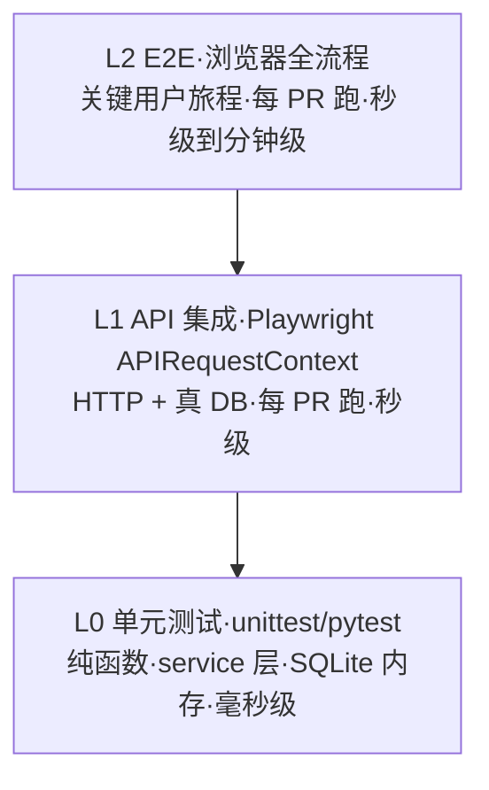

# Playwright Harness 设计方案

## 1. 背景与动机

### 1.1 当前测试现状

`tests/` 目录下全部是 `unittest` 单元测试，主要覆盖：

- `services/data_service.py` 的聚合逻辑（用 `sqlite:///:memory:`）
- `models/` 数据模型字段
- **模板"字符串包含"断言**：例如 `test_stats_dashboard.py` 里的 `self.assertIn('formatAvgLikes()', script)` —— 这种断言只能验证字符代码片段存在，**不能验证真实渲染、不能验证 JS 行为、不能验证 API 兼容性**。

### 1.2 痛点

| 维度 | 现状 | 问题 |
|---|---|---|
| 前端 | 完全没测 | Vue 模板/JS 改动只能靠人眼看 |
| API | 完全没测 | 路由删除（如 dcfcfb4 删了 `/leaderboard`）单测不会报警 |
| DB 兼容性 | 测试用 SQLite，生产用 MySQL 8 | SQL 方言、字符集、约束行为差异不暴露 |
| 模板断言 | 字符串 contains | 改重构很容易让断言假阳/假阴 |
| 集成 | 不存在 | 跨服务路径（Socket.IO、Scheduler、Crawler stub）零覆盖 |

### 1.3 已经验证

为 README 截图时，已经实际跑通：
**Playwright + Docker Compose（真 MySQL）+ Python seed/cleanup 脚本 + 全流程浏览器操作（登录 → 选房间 → 查询 → 搜索 → 点用户 → 看模态框）**。

整套 harness 完全可行，剩下的是怎么沉淀成日常测试基础设施。

---

## 2. 分层策略

参考 testing pyramid，按速度与隔离强度分 3 层：



| 层 | 用什么 | 覆盖范围 | 频率 | 单测耗时目标 |
|---|---|---|---|---|
| **L0** | `unittest` / pytest，`sqlite:///:memory:` | 纯函数、聚合算法、字段映射 | 每次保存 | < 50ms |
| **L1** | `playwright.async_api.APIRequestContext` 或 `requests`，真 Docker MySQL | API 路由 + DB 写入读出 + 业务逻辑 | 提交 / PR | < 500ms |
| **L2** | Playwright 完整浏览器 + 真服务 | 关键用户旅程（添加房间、查统计、用户搜索） | PR / merge | < 5s |

**金字塔比例目标**：L0 > 70%、L1 ≈ 25%、L2 ≤ 5%。E2E 测试只覆盖**关键回归会让产品坏掉的旅程**，不追求广。

---

## 3. 关键技术选型

### 3.1 框架：pytest（推荐切换）

| 维度 | unittest | pytest |
|---|---|---|
| Fixture | `setUp`/`tearDown`，难复用跨类 | `@pytest.fixture`，scope 灵活 |
| 参数化 | 第三方 `parameterized` | 内置 `@pytest.mark.parametrize` |
| Playwright 插件 | 无 | `pytest-playwright` 官方支持 |
| 并行 | 无 | `pytest-xdist` |
| 现有兼容 | — | pytest 能跑 unittest 风格 |

**推荐**：切到 pytest。**不强制重写现有 unittest**，pytest 能直接跑它们；新写的 L1/L2 用 pytest 风格。

### 3.2 浏览器：chromium

Firefox/WebKit 暂不覆盖。除非将来需要测跨浏览器兼容性。

### 3.3 服务编排：现有 `docker-compose.yml`

测试不引入新的服务编排。harness 启动前依赖 `docker compose up -d`。CI 用 GitHub Actions 的 docker compose action。

---

## 4. Harness 架构

```
┌─────────────────────────────────────────────────────────┐
│ pytest 运行器                                            │
│  ├─ conftest.py（全局 fixture）                          │
│  │   ├─ docker_compose_up（session scope，启动服务）    │
│  │   ├─ db_session（function scope，事务/清理）         │
│  │   ├─ authenticated_storage_state（session scope）    │
│  │   └─ api_client / browser_page                       │
│  ├─ tests/unit/      → L0（保留现有 unittest）          │
│  ├─ tests/integration/ → L1（Playwright API）           │
│  └─ tests/e2e/       → L2（Playwright Browser）         │
└─────────────────────────────────────────────────────────┘
              │
              ▼
┌─────────────────────────────────────────────────────────┐
│ Docker Compose 测试栈                                    │
│  ├─ app (Flask:7654)                                     │
│  └─ db  (MySQL 8.0:3307)                                 │
│      └─ TEST_DB（与开发库分离的独立 schema）             │
└─────────────────────────────────────────────────────────┘
              │
              ▼
┌─────────────────────────────────────────────────────────┐
│ 抖音协议层 stub（关键！）                                │
│  - crawler.fetcher 在测试环境不真连 douyin              │
│  - WebSocket 用本地 mock server 推送 protobuf 帧        │
└─────────────────────────────────────────────────────────┘
```

---

## 5. 数据隔离方案（**关键决策点**）

每个测试要拿到干净的数据库状态。4 个候选：

| 方案 | 速度 | 隔离强度 | 实现复杂度 | 与生产一致 |
|---|---|---|---|---|
| **A. per-test SQLite memory** | 极快 | 完全 | 低 | ❌ SQLite ≠ MySQL |
| **B. per-test transaction rollback** | 快 | 完全 | 高（SQLAlchemy + Flask session 协调难） | ✅ |
| **C. per-test wipe + seed** | 慢（每个 ~200ms） | 完全 | 低 | ✅ |
| **D. tagged data + cleanup by tag** | 中 | 弱（共享 schema） | 中 | ✅ |

**推荐**：**方案 C（wipe + seed），加 session-scoped baseline fixture 做加速优化**。

具体策略：
- session 启动时：truncate 所有业务表（保留 schema）
- 每个 test：function-scoped fixture 插入它需要的最小数据
- test 结束：truncate（或留给下个 test 的 fixture 处理）

性能优化：相同 fixture 用 `pytest.fixture(scope="module")` 共享数据，仅跨模块清理。

避免方案 A 的理由：**这次 review 已经踩过坑**——`avg_duration` 用 SQLite 测时 datetime 微秒会抖动产生 `10800.000483` vs `10800`，而 MySQL 不会。SQLite 测试假阳很容易麻痹我们。

---

## 6. Fixture 设计

### 6.1 基础 fixture（conftest.py）

```python
# tests/conftest.py
import pytest
from playwright.sync_api import sync_playwright

@pytest.fixture(scope="session")
def base_url():
    return "http://localhost:7654"

@pytest.fixture(scope="session")
def auth_credentials():
    return {"username": "test_admin", "password": "test_pw"}

@pytest.fixture(scope="session")
def storage_state(base_url, auth_credentials, tmp_path_factory):
    """登录一次，复用 cookie 给所有 test，避免每次重新登录"""
    state_file = tmp_path_factory.mktemp("auth") / "state.json"
    with sync_playwright() as p:
        browser = p.chromium.launch()
        context = browser.new_context()
        page = context.new_page()
        page.goto(f"{base_url}/login")
        page.fill("input[name=username]", auth_credentials["username"])
        page.fill("input[name=password]", auth_credentials["password"])
        page.click("button[type=submit]")
        page.wait_for_url(f"{base_url}/")
        context.storage_state(path=str(state_file))
        browser.close()
    return str(state_file)

@pytest.fixture
def page(browser, storage_state, base_url):
    """每个测试一个干净的认证 page"""
    context = browser.new_context(storage_state=storage_state)
    yield context.new_page()
    context.close()

@pytest.fixture
def api_client(playwright, storage_state, base_url):
    """API-only 客户端（L1）"""
    return playwright.request.new_context(
        base_url=base_url,
        storage_state=storage_state,
    )

@pytest.fixture(autouse=True)
def clean_db(db_session):
    """每个测试前 truncate 业务表"""
    for table in ['chat_messages', 'gift_messages', 'user_contributions',
                  'live_sessions', 'room_stats', 'system_events', 'live_rooms']:
        db_session.execute(text(f"TRUNCATE TABLE {table}"))
    db_session.commit()
    yield
```

### 6.2 业务 fixture（按需）

```python
@pytest.fixture
def a_room(db_session):
    room = LiveRoom(live_id="99000001", anchor_name="测试主播", status="stopped",
                    monitor_type="manual", auto_reconnect=False)
    db_session.add(room); db_session.commit()
    return room

@pytest.fixture
def a_session_with_contributions(db_session, a_room):
    """一个有 3 个贡献者的 ended session"""
    sess = LiveSession(live_id=a_room.live_id, anchor_name=a_room.anchor_name,
                       start_time=now() - timedelta(hours=2),
                       end_time=now(), status="ended",
                       total_income=1000, total_chat_count=200)
    db_session.add(sess)
    for i, name in enumerate(["甲", "乙", "丙"]):
        db_session.add(UserContribution(
            live_id=a_room.live_id, user_id=f"u{i}", user_name=name,
            total_score=(3-i)*300, gift_count=3-i, chat_count=10))
    db_session.commit()
    return sess
```

---

## 7. 选择器约定（**关键决策点**）

E2E 测试碎裂的最大来源是 selector 依赖了样式 class。强制约定：

**所有需要测试的元素必须用 `data-testid` 而不是 class**。

| 不推荐 | 推荐 |
|---|---|
| `.locator(".user-tab-button.active")` | `.locator("[data-testid=tab-chat][aria-selected=true]")` |
| `.locator("button.bg-red-500")` | `.locator("[data-testid=delete-room]")` |
| 文本 `:has-text("查询统计")` | `[data-testid=stats-submit]` |

`templates/stats.html` 里现有 `data-metric-card="total-income"` 已经是这种习惯，扩展到所有交互元素即可。

testid 命名约定：`<page>-<component>-<action>`，例如 `stats-room-select`、`leaderboard-user-row`、`modal-user-close`。

---

## 8. 抖音协议 stub

测试**绝不能真去连抖音**（被风控、抖动、外部依赖）。

方案：
- 注入环境变量 `DOUYIN_FETCHER_MODE=stub`，让 `crawler/fetcher.py` 走本地分支
- stub 模式：从 `tests/fixtures/protobuf/*.bin` 读取预录的 protobuf 帧，模拟 WebSocket 推送
- 录帧用一次性脚本 `scripts/record_douyin_frames.py`（开发者手动录一次，提交进仓库）

L2 测试可以验证：消息推到前端 → DOM 更新 → DB 写入。

---

## 9. 认证策略

- session-scoped `storage_state`：登录一次，全程复用
- 测试用独立账号 `test_admin / test_pw`（写到 `tests/.env.test`，不复用开发账号）
- 如需测试登录流程本身：单独标记 `@pytest.mark.auth_flow`，禁用 storage_state

---

## 10. CI 集成

### 10.1 本地

```bash
./scripts/test.sh          # 全跑（L0+L1+L2）
./scripts/test.sh unit     # 仅 L0（< 5s）
./scripts/test.sh api      # L0+L1（< 30s）
./scripts/test.sh e2e      # 全跑（含 L2，分钟级）
```

`scripts/test.sh` 负责：
1. 启动 docker compose 测试栈（若未运行）
2. 等 healthz
3. 跑对应层的 pytest
4. 失败时把 Playwright trace / video / screenshot 保存到 `tests/artifacts/`

### 10.2 GitHub Actions

```yaml
jobs:
  unit:
    runs-on: ubuntu-latest
    steps:
      - uses: actions/checkout@v4
      - run: pip install -e .[dev]
      - run: pytest tests/unit/
  integration:
    needs: unit
    runs-on: ubuntu-latest
    services:
      mysql: { image: mysql:8.0, env: {...} }
    steps:
      - uses: actions/checkout@v4
      - run: pip install -e .[dev] && playwright install chromium
      - run: docker compose up -d
      - run: pytest tests/integration/ tests/e2e/
      - if: failure()
        uses: actions/upload-artifact@v4
        with: { path: tests/artifacts/ }
```

L2 在 PR 阶段跑，merge 后跑全量。

---

## 11. 渐进迁移路径（不破坏现有）

| 阶段 | 内容 | 风险 |
|---|---|---|
| **P0**（本周） | 加 pytest 配置 + conftest.py + 1 个 smoke e2e（登录 → 看首页 → 退出） | 极低，不改现有 unittest |
| **P1** | L1 覆盖关键 API：`/api/rooms` CRUD、`/api/rooms/<id>/user-search`、`/api/rooms/sessions/stats` | 低 |
| **P2** | 把 `test_stats_dashboard.py` 的"字符串包含"模板断言改写为"真实渲染断言"（用 Playwright 验真渲染） | 中（要新写） |
| **P3** | L2 覆盖关键旅程：添加房间 → 启动 → 模拟收到弹幕（stub） → 看 stats → 搜用户 → 看消息卡片 | 中（要 stub 协议） |
| **P4** | 把 sqlite 单元测试中容易踩 SQL 方言坑的部分（聚合、时区、字符串函数）迁移到 L1（真 MySQL） | 中 |

**P0 落地后**就开始有收益：每个 PR 至少能验证"服务能起 + 登录能过 + 首页能开"。

---

## 12. 风险与权衡

| 风险 | 缓解 |
|---|---|
| **测试慢**，影响开发节奏 | 严格分层；L2 数量上限 20 个左右；CI 分 stage |
| **抖动**（flaky） | 用 `expect(locator).to_be_visible()` 内置等待，不用 `wait_for_timeout`；网络资源 mock |
| **维护成本** | 强制 `data-testid` 约定；fixture 集中在 conftest |
| **本地启服务门槛** | `scripts/test.sh` 自动 docker compose up |
| **抖音协议演进** | stub 帧每季度回放真实流量更新一次 |
| **磁盘 / 时间** | CI 缓存 chromium binary；docker compose 复用 volume |

---

## 13. 待用户拍板的决策

1. **框架切换 pytest 还是继续 unittest？** —— 推荐切。pytest-playwright 是关键。
2. **数据隔离用方案 C（wipe+seed）还是其它？** —— 推荐 C。
3. **抖音协议 stub 录制谁来做？什么时间窗口？** —— P3 阶段再定。
4. **CI 平台**：GitHub Actions 还是其它？
5. **测试账号**：用独立 `test_admin` 还是借用 dev `.env`？—— 强烈推荐独立账号。
6. **是否引入 `pytest-xdist` 做并行？** —— P1 之后再说，并行需要数据隔离更严。

---

## 14. 后续工作（不在 P0 范围）

- 性能基线：每个 L2 测试记录耗时，趋势超过阈值告警
- 视觉回归（snapshot diff）：Playwright 内置截图对比，对 UI 改动有保护
- 协议帧录制工具：长期维护抖音协议变化
- 测试数据浏览器：本地起一个 fixture 预览页，便于手工核对 seed 数据
