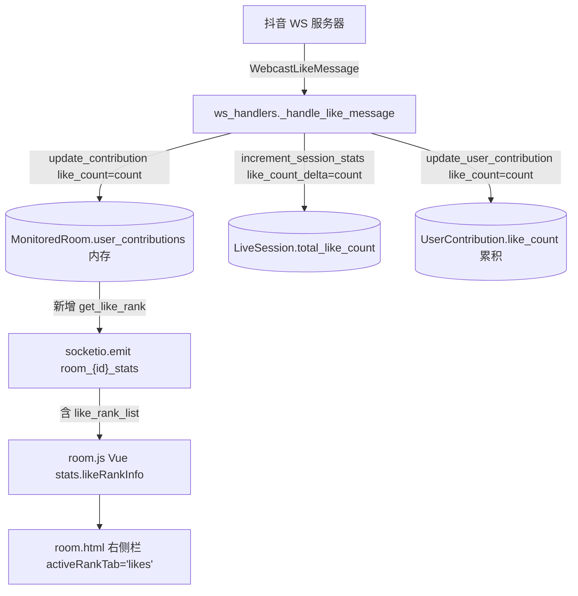
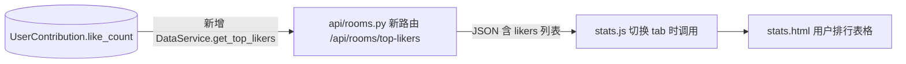

# 点赞榜（Likes Leaderboard）设计

## 1. 背景与目标

DouyinLiveHub 当前的房间详情页（`room.html`）右侧栏只有「贡献榜」（按礼物钻石值排序）；同样的「贡献榜」在数据统计页（`stats.html`）也有按时间范围的累积版。但**点赞**作为另一类高频、低成本的互动行为，目前只在统计卡片显示「累计点赞数」一个汇总值，没有 per-user 维度的展示。

本设计为以下两个场景补齐点赞维度：

1. **直播详情页 `room.html`**：在右侧栏现有「贡献榜」区域新增「点赞榜」tab，实时展示**本场**各用户的点赞次数排行。
2. **数据统计页 `stats.html`**：在「用户排行」区域新增「点赞榜」tab，按房间累积维度展示各用户的总点赞数。

## 2. 范围 / 非范围

### 范围内

- room 页右侧栏 tab 切换「🏆 贡献榜 / ❤️ 点赞榜」，点赞榜仅展示**进行中的直播场次**数据。
- stats 页「用户排行」区域加 tab，点赞榜按房间显示用户累积点赞 TOP 100。
- 实时刷新：复用现有 `room_{live_id}_stats` Socket.IO 事件，新增 `like_rank_list` 字段。
- 用户匿名处理与现有贡献榜一致（id=0/111111 → `anon_用户名_等级`）。

### 非范围（YAGNI）

- **不**新增点赞明细表（`like_messages`）或场次×用户点赞表（`session_user_likes`）。当前需求是「实时进行中」，不需要回放历史场次的点赞榜。
- **不**支持 stats 页点赞榜按日期范围筛选（数据库没有点赞明细，只有累积值）。
- **不**改动现有的「累计点赞数」统计卡片（room 页头部那个红心数字保留不动）。
- **不**为「历史数据」按钮位置做改动（独立讨论项，与本设计解耦）。
- **不**做跨房间点赞汇总（同一 user_id 在多房间显示为多行而非求和）。

## 3. 关键设计决策

| 决策 | 选择 | 理由 |
|------|------|------|
| Q1 数据生命周期 | 仅显示进行中场次（内存方案） | 无需 schema migration；用户场景就是「当前场次」；重启丢失可接受 |
| Q2 入口位置 | room 页右侧栏 + tab 切换 | 改动最小，与现有「全部/弹幕/礼物」tab 模式一致 |
| Q3 总榜形态 | stats 页用户排行加 tab，仅累积、不支持日期筛 | 复用 `UserContribution.like_count`，不引入明细表 |
| 用户范围 | 所有点赞过的用户（不要求送过礼物） | 这是点赞榜的语义自洽 |
| TOP 数量 | 100，与贡献榜对齐 | UI 一致性 |
| 排序字段 | `like_count` DESC | 唯一合理排序 |

## 4. 架构与数据流

### 4.1 实时点赞榜数据流（room 页）



要点：
- `MonitoredRoom.user_contributions` 在场次切换时已经会被清空（见 `handlers.py` 第 951 行），点赞榜跟随重置，无需额外逻辑。
- `like_count` 的累加已经在 `update_contribution(..., like_count=count, ...)` 里完成，本设计不改累加逻辑，只**加一个读侧的 rank 函数 + emit 字段**。

### 4.2 累积点赞榜数据流（stats 页）



要点：
- `UserContribution.like_count` 是 per-`(live_id, user_id)` 的累积值，由 `update_user_contribution` 在每条点赞消息到达时增量累加（已有逻辑）。
- 新路由仅 read，按 `like_count DESC` 取 TOP N。可选 `live_id` 参数：传则筛单房间，不传则跨房间各行展示。

## 5. 模块改动清单

| 文件 | 改动 | 估算行数 |
|------|------|---------|
| `services/room_manager.py` | 新增 `MonitoredRoom.get_like_rank(limit=100)` | +30 |
| `ws_handlers/handlers.py` | `_handle_like_message` / `_handle_stats_message` 的 emit payload 增加 `like_rank_list` | +5 |
| `app.py` | 客户端 `join` 事件的初次 stats 推送增加 `like_rank_list` | +1 |
| `services/data_service.py` | 新增 `get_top_likers(live_id, limit)` | +30 |
| `api/rooms.py` | 新增 `GET /api/rooms/top-likers`（可选 `live_id` 筛选） | +30 |
| `templates/room.html` | 右侧栏 header 加 tab；条目模板复用现有结构换字段 | +60 |
| `templates/stats.html` | 用户排行区域加 tab；切到点赞榜时禁用日期控件 | +60 |
| `static/js/room.js` | `activeRankTab` 状态、`stats.likeRankInfo`、tab 切换方法、Socket 事件接收 | +40 |
| `static/js/stats.js` | `activeRankTab` 状态、切 tab 时拉 `/api/rooms/likers`、禁用日期控件 | +50 |
| **合计** | | **~306 行** |

## 6. UI 设计

### 6.1 room.html 右侧栏（详见 brainstorm mockup A 节）

Tab 顺序：「🏆 贡献榜 / ❤️ 点赞榜」。Tab 徽章显示当前榜单条目数（如 `❤️ 点赞榜 37`）。

条目字段（从左到右）：

1. 排名徽章 — `rank-1/2/3` 金银铜渐变，`rank-other` 灰色（复用现有 `.rank-badge` 样式）
2. 头像（32×32 圆形，无头像走默认）
3. 用户名（可点击进入用户消息模态框，复用 `openUserMessagesModal`）
4. 等级图标 `level_img/level_{n}.png`
5. 粉丝团图标 `fansclub_img/fansclub_{n}.png`（仅当 level > 0）
6. 点赞数 `❤️ <数字> 次点赞`，数字用 `formatNumber` 千位分隔

空状态：

```
       ❤️
  本场暂无点赞数据
   等待观众开始点赞...
```

### 6.2 stats.html 用户排行（详见 brainstorm mockup C 节）

表头上方加 tab：「🏆 贡献榜 / ❤️ 点赞榜」。

切到点赞榜时：

- 日期范围控件 disabled（灰显，hover 显示 tooltip：「点赞榜仅看累积，不支持时间筛选」）
- 表头列：排名 / 用户 / 所在房间 / **累积点赞** / 送礼次数
- 数据来源：`UserContribution.like_count`，仅含 `like_count > 0` 的用户；按 live_id 筛选；不选房间时跨房间各行展示

切回贡献榜时：

- 日期范围控件恢复启用，原有交互不变
- 表头列恢复贡献榜原列
- 这个对称行为由 `activeRankTab` 单一状态驱动，避免遗留禁用状态

## 7. 实时刷新协议

Socket.IO `room_{live_id}_stats` 事件 payload **新增字段** `like_rank_list`：

```json
{
  "...": "...（其他既有字段不变）",
  "like_rank_list": [
    {
      "rank": 1,
      "user_id": "MS4wLjABAAAA...",
      "user": "小灰灰的妈",
      "like_count": 12840,
      "avatar": "https://...",
      "user_level": 45,
      "fans_club_level": 8
    }
  ]
}
```

形态故意与 `contributor_info` 对齐，方便前端复用渲染组件，只需把 `score` 字段映射成 `like_count`。

**推送时机**：

- `_handle_like_message` 末尾（已有 stats 推送，在 payload 中加上 `like_rank_list`）
- `_handle_stats_message` 末尾（同上）
- `app.py` 的 `join` 事件的初次 stats 推送
- `_end_current_session` / `room_manager.end_current_session`：场次结束推送 `like_rank_list: []`，前端显示为空状态

明确**不在**每条弹幕（`_handle_chat_message`）和每条礼物（`_handle_gift_message`）推送，避免无关消息拖累带宽（这两处目前也只 emit `room_{live_id}` 消息事件，不 emit stats 事件，保持现状）。

## 8. REST API

### `GET /api/rooms/top-likers`

总榜接口（stats 页用）。

**Query 参数**：

| 名称 | 类型 | 必需 | 说明 |
|------|------|------|------|
| `live_id` | string | 否 | 不传则跨房间，传则筛单房间 |
| `limit` | int | 否 | 默认 100，上限 1000 |

**返回**：

```json
{
  "likers": [
    {
      "live_id": "261378947940",
      "anchor_name": "主播A",
      "user_id": "...",
      "user_name": "小灰灰的妈",
      "user_avatar": "...",
      "like_count": 128400,
      "gift_count": 42,
      "user_level": 45,
      "fans_club_level": 8
    }
  ],
  "total": 87,
  "source": "summary"
}
```

`source: "summary"` 标记表明数据来自 `UserContribution` 累积视图（与现有 `get_summary_contributors` 返回格式对齐）。

## 9. 边界场景与错误处理

| 场景 | 行为 |
|------|------|
| 场次切换（新一场开播） | `MonitoredRoom.user_contributions` 已有清空逻辑，点赞榜自动重置 |
| 应用重启 | 本场点赞榜清空（Q1 已接受） |
| 匿名用户点赞 | `anon_用户名_等级` 作为 user_id 合并 |
| 用户改名 | 跟现有 `update_contribution` 一致：更新最新用户名 |
| 点赞用户 like_count 为 0 | 不显示（榜单仅含 `like_count > 0` 的用户） |
| 同一 user_id 多房间累积 | stats 页跨房间查询时显示多行（每行一个 live_id），不汇总 |
| stats 切到点赞榜后再切换房间 | 重新拉接口；保持 tab 状态 |
| 移动端右侧栏布局 | Tab 高度与现有「贡献榜」标题相当，不破坏 grid 布局 |

## 10. 验证清单

实施完成时需逐项确认：

- [ ] room 页 tab 切换不破坏现有贡献榜显示
- [ ] 实时点赞消息进来后点赞榜数字递增
- [ ] 同一用户连续点赞只占榜单一行，数字累加
- [ ] 匿名用户合并正确（同名同等级合并为一条）
- [ ] 新一场直播开播时点赞榜清零
- [ ] stats 页点赞榜显示累积数据
- [ ] stats 页切到点赞榜时日期范围控件禁用，hover 有 tooltip 提示
- [ ] stats 页跨房间显示同一 user_id 的多条记录而非求和
- [ ] 用户名点击进入消息模态框
- [ ] 移动端布局不破坏

## 11. 不在本期、后续可扩展

- 加 `like_messages` 明细表 → 支持按时间范围筛选的点赞榜
- 加 `session_user_likes` 表 → 历史场次点赞榜可回放
- 跨房间点赞总榜（按 user_id GROUP BY 求和）
- 点赞榜独立页面 `/room/<id>/likes`（深度查看，含分页）
- 与「关注/分享」等其他互动维度的多榜对比

## 12. 参考资料

- Brainstorm 视觉素材：`.superpowers/brainstorm/27593-1779811463/content/`
- 现有贡献榜实现：
  - `services/room_manager.py::MonitoredRoom.get_contribution_rank`
  - `services/data_service.py::get_summary_contributors`
  - `templates/room.html` 右侧栏区块
  - `templates/stats.html` 用户排行区块
- 现有点赞处理：`ws_handlers/handlers.py::_handle_like_message`
