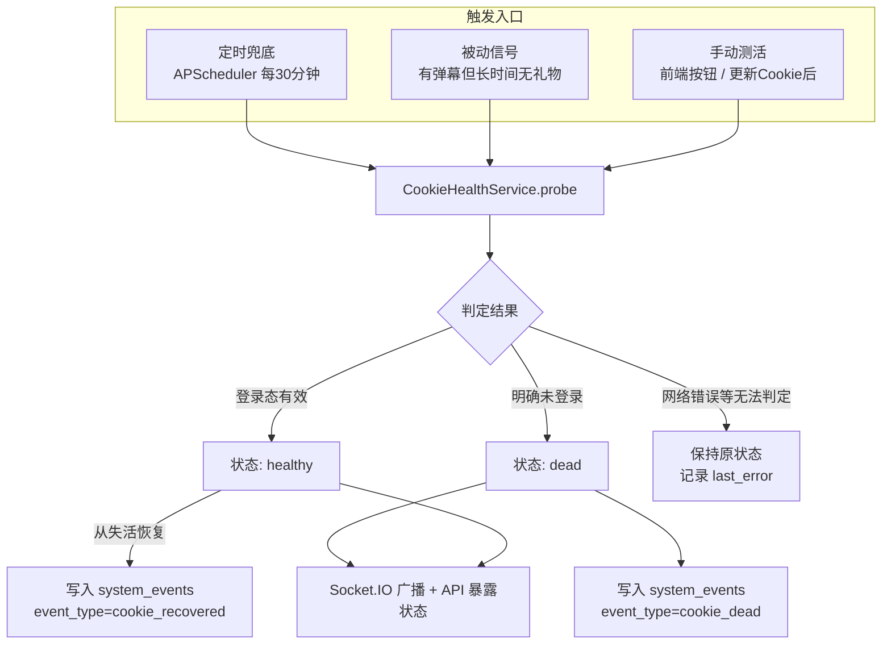

# Cookie 测活（健康检测）功能设计

- 日期：2026-06-10
- 状态：已与用户确认

## 背景与目标

2026-05 起，游客身份（不带登录 Cookie）连接抖音直播 WebSocket 可能收不到礼物推送（`WebcastGiftMessage`），因此项目通过 `DOUYIN_COOKIE` 配置登录 Cookie。但 Cookie 会失活，失活后 WebSocket 仍能连接、弹幕正常，仅礼物数据静默缺失，用户无法及时感知。

目标：系统能自动发现 Cookie 失活，在前端醒目提示，并在数据库留下失活/恢复的时间记录，便于事后判断哪段时间的礼物数据不可信。

明确不做（YAGNI）：

- 外部通知渠道（Server酱/Telegram 等）
- 场次数据的"礼物数据不完整"自动标记
- Cookie 自动续期/自动登录

## 总体方案：混合检测

被动信号作为触发器，主动探测作为判定依据，外加低频定时兜底和手动触发。



## 核心组件：CookieHealthService

新增 `services/cookie_health.py`（预计 ~200 行），作为 Cookie 健康状态的唯一权威。

### 状态机

| 状态 | 含义 |
|------|------|
| `unconfigured` | 未配置 Cookie |
| `unknown` | 已配置但从未探测成功过（如刚启动） |
| `healthy` | 最近一次探测确认登录态有效 |
| `suspect` | 被动信号触发怀疑、探测确认中；或单次探测失败（防抖中） |
| `dead` | 连续 2 次主动探测确认未登录 |

### 防抖规则

- 只有"明确未登录"才计入失败次数；网络超时、5xx、JSON 解析失败等无法判定的结果**不改变状态**，仅记录 `last_error`。
- 连续 2 次明确未登录才从 `suspect` 转 `dead`，避免单次抖动误报。
- 手动触发的探测跳过防抖：单次明确未登录即判 `dead`（人主动确认的场景）。

### 内部状态字段

`status`、`last_check_time`、`last_ok_time`、`fail_count`、`last_error`、`last_trigger`（scheduled / passive / manual / cookie_updated）。内存态即可，重启后回到 `unknown` 并由首次定时探测刷新。

## 主动探测判定逻辑（核心技术点）

复用 `crawler/fetcher.py` 已有的请求基础设施（Cookie 头构造、代理配置），请求抖音登录态自检接口：

```
GET https://live.douyin.com/webcast/user/me/?aid=6383&device_platform=web
```

判定规则：

| 响应情况 | 判定 |
|----------|------|
| `status_code == 0` 且 `data` 含有效用户（`id_str` 非空且非 `"0"`） | 登录态有效 |
| 响应正常但无用户信息 / 状态码表示未登录 | 明确未登录 |
| HTTP 错误、超时、JSON 解析失败 | 无法判定（不改状态） |

**风险与兜底**：该接口的实际响应结构需在实施第一步用真实 Cookie 实测（活 Cookie 与故意改坏的 Cookie 各一次）确认判定字段。若接口不可用，备选方案为复用项目已在用的 `webcast/room/web/enter` 接口（响应包含当前登录观众的 `user` 字段，登录与否内容不同）。

探测请求独立于运行中的房间，走与 fetcher 相同的代理配置。

## 被动信号（触发器）

在 `ws_handlers/handlers.py` 消息分发处，为每个 `WebDouyinLiveFetcher` 记录两个内存时间戳：`last_chat_time`、`last_gift_time`（不入库）。

判定逻辑放在定时任务中（不在消息热路径上判断）：

> 存在至少一个房间：最近 10 分钟内有弹幕（直播间活跃、连接正常），但最近 30 分钟内没有任何礼物 → 触发一次主动探测。

限流：被动信号触发的探测最快 15 分钟一次。

误报说明：冷门房间没人送礼属正常，该信号只触发"主动探测确认"，不直接改状态，误报代价仅为一次轻量请求。

## 定时任务与配置

挂到现有 `SchedulerService`：

| 任务 | 间隔 | 内容 |
|------|------|------|
| Cookie 健康检查 | `COOKIE_HEALTH_CHECK_INTERVAL`（默认 1800s） | ① 定时主动探测；② 顺带评估被动信号，命中则立即再探测确认 |

新增环境变量（`config.py`）：

```bash
COOKIE_HEALTH_CHECK_INTERVAL=1800   # 定时探测间隔，0=关闭定时探测
COOKIE_HEALTH_GIFT_SILENCE=1800     # 被动信号: 无礼物多久算可疑(秒)
COOKIE_HEALTH_CHAT_ACTIVE=600       # 被动信号: 多久内有弹幕算活跃(秒)
```

## API 变更（app.py）

1. **扩展 `GET /api/douyin-cookie`**，新增健康信息：

```json
{
  "configured": true,
  "length": 3000,
  "health": {
    "status": "healthy",
    "last_check_time": "2026-06-10 12:00:00",
    "last_ok_time": "2026-06-10 12:00:00",
    "last_error": null,
    "trigger": "scheduled"
  }
}
```

2. **新增 `POST /api/douyin-cookie/check`**：手动触发一次探测，同步返回结果（跳过防抖）。
3. **`POST /api/douyin-cookie`（更新 Cookie）后自动探测一次**，响应中带上探测结果——粘贴完 Cookie 立刻知道是否有效。
4. 状态变化时通过 Socket.IO 广播 `cookie_health` 事件。

## 系统事件记录

状态跨越边界时写 `system_events`（`live_id=None`，全局事件，模型本身允许为空，无需迁移）：

- `cookie_dead`：进入失活，message 记录触发来源与错误详情
- `cookie_recovered`：从失活恢复（通常为更新 Cookie 后）

只在状态切换时写，不每次探测都写。事后查"哪段时间礼物数据不可信"即查这两类事件的时间区间。

## 前端展示（templates/index.html + static/js/index.js）

1. **Cookie 设置区域**：状态徽章 + 详情
   - 🟢 正常（最后确认时间）/ 🟡 确认中 / 🔴 已失活（失活时间 + 原因）/ ⚪ 未配置 / 灰 未知
   - 新增"测活"按钮，点击调 `POST /api/douyin-cookie/check`，等待期间按钮转圈
2. **页面顶部横幅**：`status == dead` 时显示红色横幅"⚠️ 抖音 Cookie 已失活，礼物数据可能缺失，请更新 Cookie"，恢复后自动消失
3. 通过 Socket.IO `cookie_health` 事件实时更新；页面加载时从 `GET /api/douyin-cookie` 取初始状态
4. 注意 Jinja2 / Vue 模板分隔符冲突，统一使用 `v-text` / `v-if` 指令

## 文件改动清单

| 文件 | 改动 | 性质 |
|------|------|------|
| `services/cookie_health.py` | 状态机 + 探测逻辑 + 被动信号评估 | 新增（~200 行） |
| `services/scheduler_service.py` | 注册健康检查任务 | 小改 |
| `ws_handlers/handlers.py` | 记录 `last_chat_time` / `last_gift_time` | 小改 |
| `app.py` | 扩展 GET、新增 check 接口、更新后自动探测、Socket.IO 广播 | 中改 |
| `config.py` | 3 个新环境变量 | 小改 |
| `templates/index.html` + `static/js/index.js` | 状态徽章、测活按钮、顶部横幅 | 中改 |
| `tests/` | 状态机单测 + API 集成测试 | 新增 |

无数据库迁移。

## 测试策略

- **单测**：状态机转换（防抖 2 次才 dead、网络错误不改状态、恢复事件只写一次）、被动信号判定逻辑——探测函数 mock 掉
- **集成测试**：沿用现有 pytest harness，覆盖 `GET/POST /api/douyin-cookie*` 三个接口
- **实施第一步**：用真实 Cookie 手动验证探测接口判定字段（活/坏 Cookie 各一次），确定判定规则后再写代码

## 实现备注（2026-06-10 实施时调整）

1. **Socket.IO 广播改为前端轮询**：首页本无 Socket.IO 连接（纯 fetch + 5 秒轮询），
   为 Cookie 状态引入 Socket.IO 得不偿失；`loadCookieConfig()` 加入现有 5 秒轮询即可实时感知。
2. **调度落地为单个 5 分钟 tick**：每次 tick 评估被动信号（命中且距上次探测 ≥15 分钟则探测）；
   距上次探测 ≥ `COOKIE_HEALTH_CHECK_INTERVAL` 则执行定时探测。语义与原设计等价，单任务更易测试。
3. **探测接口实测结论**：`webcast/user/me` 活 Cookie 返回 `status_code=0` + `data.id_str`；
   坏 Cookie 返回 `status_code=20003`（"User doesn't login"），与设计假定的判定规则一致，未做校准。
